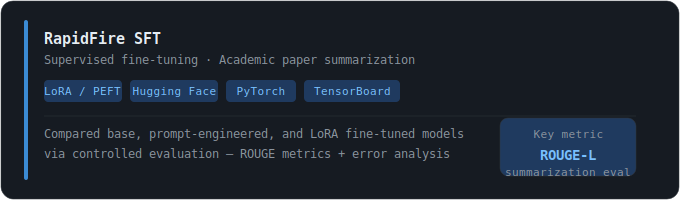
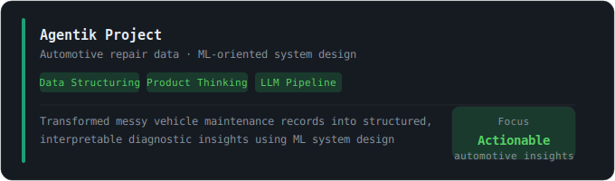
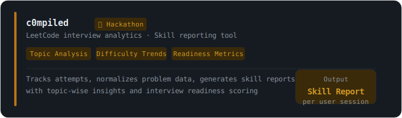
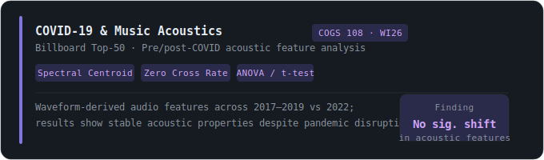

# **Nalin Joshi**

Math-CS @ UCSD · Probabilistic ML · Stochastic Systems · Software Engineering

---

## 🛠 Tools & Languages

---

## 🔬 Research Interests

🎲 Stochastic Processes & Markov Chains
📊 Bayesian Inference & Probabilistic Modeling
🔧 Parameter-Efficient Fine-Tuning (LoRA, PEFT)
📐 Random Utility Models & Value Alignment
🧠 Interpretable & Uncertainty-Aware ML

---

## 💻 Featured Projects

### Personal Projects

### 🏆 Hackathon

### 🎓 University Project

---

## 📚 Relevant Coursework

| Course | Key Topics |
|--------|-----------|
| **Math 189** · Exploratory Data Analysis & Inference | Statistical learning, regression, classification, resampling, regularization, SVMs, unsupervised learning, hypothesis testing |
| **Math 180B/C** · Stochastic Processes I & II | Markov chains, Chapman-Kolmogorov equations, hitting times, stationary distributions, Poisson processes, renewal theory, martingales, Brownian motion, MCMC |
| **Math 154** · Graph Theory | Connectivity, spanning trees, Dijkstra's algorithm, matchings, graph coloring, planar graphs, max-flow min-cut |
| **Math 100A/B** · Abstract Algebra I & II | Groups, rings, fields, polynomial rings, linear transformations, inner product spaces, diagonalization |
| **CSE 101** · Algorithm Design & Analysis | Divide and conquer, dynamic programming, greedy algorithms, graph algorithms, NP-completeness |
| **CSE 100** · Advanced Data Structures | Balanced trees, priority queues, hash tables, memory management, performance analysis |
| **Math 20A–E** · Calculus | Multivariable calculus, optimization, vector calculus, Green's, Stokes', and Gauss' theorems |

## 📬 Contact

*Open to research collaborations and ML engineering roles · Graduating June 2026*

